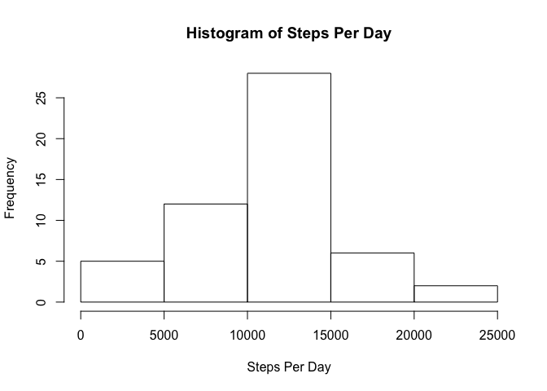
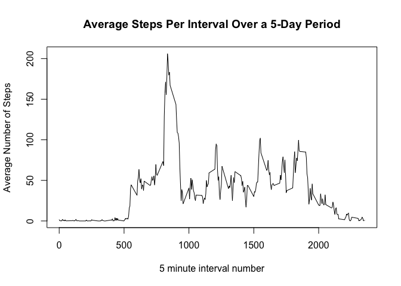
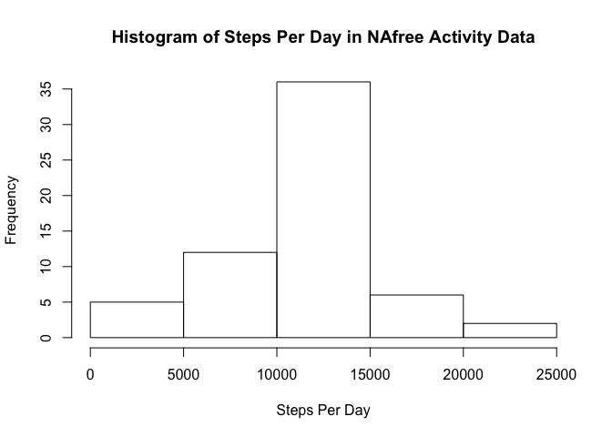
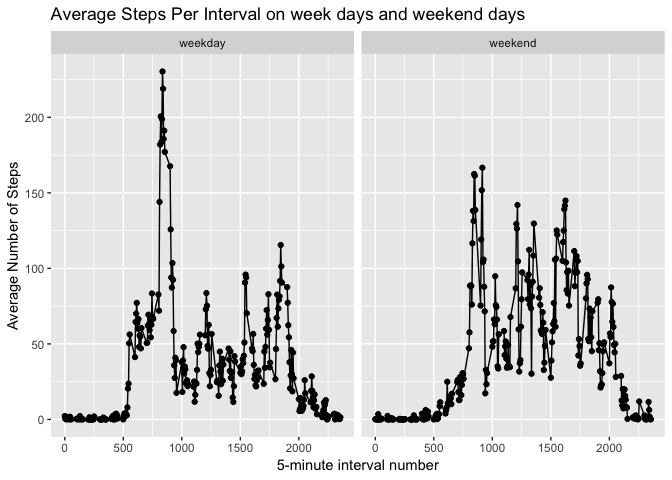

## Loading and preprocessing the data

The following code downloads the data, unzips it and stores it in the "activitydata" dataframe.


```r
#download the data
filename<-"repdata%2Fdata%2Factivity.zip"
fileurl<-"https://d396qusza40orc.cloudfront.net/repdata%2Fdata%2Factivity.zip"
if(!file.exists(filename)){
  download.file(fileurl, filename)
}

#unzip the file
unzip(zipfile = filename)

#Read the data into activity data frame using read.csv
```

```r
activitydata<-read.csv("activity.csv")
```


## What is mean total number of steps taken per day?

The following code uses the aggregate function to find the sum of steps per day and stores the result as a new data frame called stepsperday


```r
stepsperday<-aggregate(steps~date,data=activitydata,sum)
```

The following code use the hist function to plot a histogram of steps per day


```r
with(stepsperday,hist(steps, main= "Histogram of Steps Per Day", xlab="Steps Per Day" ))
```

<!-- -->

The following code calculates and reports the mean number of steps per day.


```r
Meanstepsperday<-mean(stepsperday$steps)

print(paste("The mean steps per day are", Meanstepsperday))
```

```
## [1] "The mean steps per day are 10766.1886792453"
```

The following code calculates and reports the median Steps per day


```r
Medianstepsperday<-median(stepsperday$steps)

print(paste("The Median steps per day are",Medianstepsperday))
```

```
## [1] "The Median steps per day are 10765"
```


## What is the average daily activity pattern?

The following code makes a new data frame with average steps per 5-minute interval, stepsperinterval, using the aggregate function. 

```r
# use aggregate to make new dataframe of average steps per interval 
stepsperinterval<-aggregate(steps~interval,data=activitydata,mean)

#rename the "steps" column to "mean.steps"
names(stepsperinterval)[names(stepsperinterval)=='steps']<-'mean.steps'
```

The following code uses qplot to make a time series plot of the 5-minute interval and average number of steps taken. 


```r
with(stepsperinterval,plot(interval,mean.steps, type="l", xlab = "5 minute interval number", ylab="Average Number of Steps", main="Average Steps Per Interval Over a 5-Day Period"))
```

<!-- -->

The following code finds and reports the interval with the maximum number of steps across all days in the dataset.


```r
maxsteps<-stepsperinterval[which(stepsperinterval$mean.steps==max(stepsperinterval$mean.steps)),]

print(paste("The 5-minute interval, on average across all the days in the dataset, that contains the maximum number of steps,",maxsteps[1,2],", is interval number",maxsteps[1,1]))
```

```
## [1] "The 5-minute interval, on average across all the days in the dataset, that contains the maximum number of steps, 206.169811320755 , is interval number 835"
```


## Imputing missing values

The following code determines and reports the number of missing values for the dataset


```r
activityNAs<-sum(is.na(activitydata$steps))

print(paste("The number of missing values is ",activityNAs))
```

```
## [1] "The number of missing values is  2304"
```

My strategy to replace the NAs with number of average steps is to split the dataframe by the factor "interval"" using the split function and then I will loop through the resulting lists of dataframes using a for loop and lapply to apply a function called Na2mean that calculates the column mean and replaces any NAs in that column with the column mean. 

The following code creates a new data set, activitydataNAfree, where the NAs are replaced by the mean steps per interval. 


```r
splitactivity<-split(activitydata,activitydata$interval)

# I'm going to use the NA2mean function from G. Grothendieck here https://stackoverflow.com/questions/25835643/replace-missing-values-with-column-mean

NA2mean <- function(x) replace(x, is.na(x), mean(x, na.rm = TRUE))


#use a for loop to apply the Na2mean to all of the data frames in the split activitydata dataframe 

suppressWarnings(for ( i in 1:length(splitactivity)){
  splitactivity[[i]] <- lapply(splitactivity[[i]], NA2mean)
  splitactivity[[i]] <- as.data.frame(splitactivity[[i]])
}
)

#use do.call to "unsplit" the splitactivity data set and store in a new variable, activitydataNAfree

activitydataNAfree<-do.call("rbind",splitactivity)
```

The following code makes a histogram of steps per day without NAs


```r
##Calculate the total Steps per day in the data set with NAs removed

stepsperdayNAfree<-aggregate(steps~date,data=activitydataNAfree,sum)


with(stepsperdayNAfree,hist(steps, main= "Histogram of Steps Per Day in NAfree Activity Data", xlab="Steps Per Day" ))
```

<!-- -->

The following code calculates and reports Mean and Median steps per day, and answers the question whether these values differ in the original dataset and the NAfree dataset. 


```r
MeanstepsperdayNAfree<-mean(stepsperdayNAfree$steps)

#report mean steps per day

print(paste("The mean steps per day are", MeanstepsperdayNAfree))
```

```
## [1] "The mean steps per day are 10766.1886792453"
```

```r
#Calculate the Median Steps per day

MedianstepsperdayNAfree<-median(stepsperdayNAfree$steps)

print(paste("The Median steps per day are",MedianstepsperdayNAfree))
```

```
## [1] "The Median steps per day are 10766.1886792453"
```

```r
#Report difference between mean and median calculated with and without NAs included

differenceinMeans<-MeanstepsperdayNAfree-Meanstepsperday

differenceinMedians<-MedianstepsperdayNAfree-Medianstepsperday

print(paste("When NAs aren't included in the data set the difference steps per day is", differenceinMeans, ", and the difference between median steps per day is", differenceinMedians))
```

```
## [1] "When NAs aren't included in the data set the difference steps per day is 0 , and the difference between median steps per day is 1.1886792452824"
```

## Are there differences in activity patterns between weekdays and weekends?

The following code converts the dates in the "date" column into days of the week using the weekdays function. Then it uses a for loop to convert Sundays and Saturdays to the factor variable "weekend" and all other days to the factor variable "weekday". Finally, the code uses qplot to make a time series plot of the 5-minute interval and average number of steps taken separately for week days and weekend days. 


```r
#convert dates to days of the week

activitydataNAfree$date<-weekdays(as.Date(activitydataNAfree$date))

#onvert weekdays to either weekend or weekday

activitydataNAfree$date<-lapply(activitydataNAfree$date, function(x) 
  if (x == "Saturday"| x=="Sunday"){
  x <- "weekend"
  }else {
  x<- "weekday"
  }
)
    
#convert character variable into factor variable (using lapply turned the column into a list so I need to use unlist to convert it to a vector)

activitydataNAfree$date<-as.factor(unlist(activitydataNAfree$date))

#Make a panel plot containing a time series plot (i.e. \color{red}{\verb|type = "l"|}type="l") of the 5-minute interval (x-axis) and the average number of steps taken, averaged across all weekday days or weekend days (y-axis). 

weekendvsweekdayaveragestepsperinterval<-aggregate(data=activitydataNAfree,.~date+interval, mean)

#make the plot using qplot from the ggplot2 package

library(ggplot2)

qplot(interval,steps,data=weekendvsweekdayaveragestepsperinterval,facets =. ~date, main = "Average Steps Per Interval on week days and weekday days", ylab="Average Number of Steps",xlab="5 minute interval number",geom=c("point","line"))
```

<!-- -->

